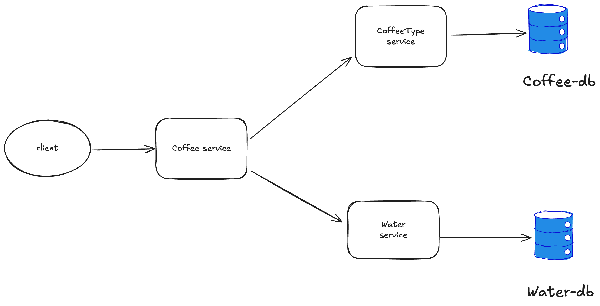
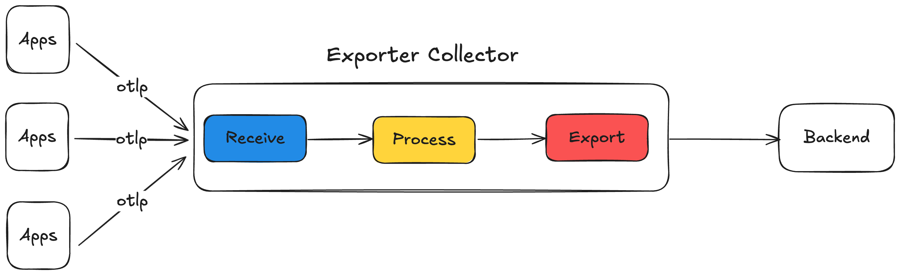

# CoffeeHouse 

Demo setup for NestJS apps with [OpenTelemetry](https://opentelemetry.io/), [Prometheus](https://prometheus.io/), [Grafana](https://grafana.com/grafana/), [Loki](https://grafana.com/oss/loki/) and [Tempo](https://grafana.com/oss/tempo/) to demonstrate Observability use-cases. 

## Architecture



## OpenTelemetry Collector integration



## Start dependencies
```
    docker compose up
```
## Stop dependencies
```
    docker compose down
```

## Useful URLs
- UI: http://localhost:8092
- Water Service: http://localhost:3010
- Coffee Type Service: http://localhost:3011
- Coffee Type Service: http://localhost:3012
- Grafana: http://localhost:4000
- Loki, Grafana, Tempo: http://localhost:3000

## Built by 
- Marius Vincent NIEMET [Twitter](https://x.com/mariusniemet05) [Linkedin](https://www.linkedin.com/in/marius-vincent-niemet-928b48182/)